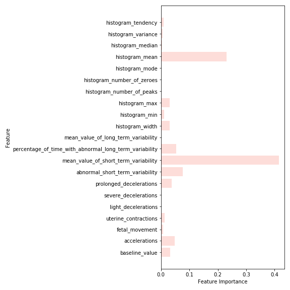

# Fetal Health Classification

**Author**: Diane Tunnicliffe

## Overview
This project addresses the major public health problem that is fetal mortality. Using data from actual patients' cardiotocography (CTG) exams and their accomponaying fetal health outcomes assigned by expert obstetricians, I have determined that automated assessment of fetal health is possible using CTG data.

## Business Problem

I address the question of how to predict fetal health outcomes based on CTG data. This information can be used by medical professionals, specifically in the field of obstetrics, to minimize the occurrence of fetal mortality. While this is arguably more of a health problem than a business problem, medical practices can benefit greatly from these findings by ensuring the best possible patient health.
Recommendations answer the following questions:
1. Can performing CTGs as preventative care help predict fetal health outcomes?
2. If so, which measures on a CTG exam are most significant when predicting fetal health outcomes?
3. What can an individual healthcare provider do to help the global cause of decreasing fetal mortality? What exactly should be prioritized?

### Hypotheses
Null hypothesis (H0): There is no relationship between automated CTG data and fetal health outcome.

Alternative hypothesis (Ha): There is a relationship between automated CTG data and fetal health outcome.

## Data
"Reduction of child mortality is reflected in several of the United Nations' Sustainable Development Goals and is a key indicator of human progress. The UN expects that by 2030, countries end preventable deaths of newborns and children under 5 years of age, with all countries aiming to reduce under‑5 mortality to at least as low as 25 per 1,000 live births.

Parallel to notion of child mortality is of course maternal mortality, which accounts for 295 000 deaths during and following pregnancy and childbirth (as of 2017). The vast majority of these deaths (94%) occurred in low-resource settings, and most could have been prevented.

In light of what was mentioned above, Cardiotocograms (CTGs) are a simple and cost accessible option to assess fetal health, allowing healthcare professionals to take action in order to prevent child and maternal mortality. The equipment itself works by sending ultrasound pulses and reading its response, thus shedding light on fetal heart rate (FHR), fetal movements, uterine contractions and more."  

The dataset used for this project can be found at https://www.kaggle.com/andrewmvd/fetal-health-classification. It contains 2,126 rows of 22 features extracted from Cardiotocogram (CTG) exams, which were then classified by three expert obstetritians into 3 classes:
* Normal
* Suspect 
* Pathological  


Citation: Ayres de Campos et al. (2000) SisPorto 2.0 A Program for Automated Analysis of Cardiotocograms. J Matern Fetal Med 5:311-318. The original study can be found at https://onlinelibrary.wiley.com/doi/10.1002/1520-6661(200009/10)9:5%3C311::AID-MFM12%3E3.0.CO;2-9. 

## Method
The work in my main notebook follows the CRISP-DM method. I imported data from reputable sources, then cleaned, processed, scaled, and adjusted the data to account for class imbalance. I utilized descriptive statistics as well as visualizations to illuminate trends in the data and isolate key factors for making fetal health predictions. I built pipelines and grid search functions to iterate through models and find optimal hyperparameters. When I determined my best model, based on the recall metric for this particular case, I evaluated it thoroughly so that I could make informed recommendations.

The original data had three possible fetal health outcomes: Normal, Suspect, and Pathological.


I combined the Suspect and Pathological classes into a category called At Risk to transform this into a binary classification problem.


I utilized the class_weight='balanced' sklearn parameter to account for the class imbalance and provide a more accurate model.

## Results
There is a correlation between prolonged fetal heart rate decelerations and fetal health outcome. Generally speaking, the greater number of prolonged declerations, the greater the risk. 


There was a clear relationship between abnormal short and long term fetal heart rate variability and fetal health outcome.


The models prioritized abnormal short and long term variability of fetal heart rate as top important features when making predictions.



## Evaluation
All models were primarily evaluated on the recall/sensitivity metric to determine which model performed best. I iterated through seven models in total, optimizing for hyperparameters along the way: baseline (Decision Tree), Decision Tree, Logistic Regression, Support Vector Machine, Random Forest, Extra Trees, and TPOT (Automated ML classifier). 

The positive class is 'At Risk' and the negative class is 'Normal'. The objective is to minimize false negatives and err on the side of caution. I have prioritized Recall/Sensitivity as the metric by which to evaluate the models. This will ensure that we capture all instances of the positive class, which makes this the most important metric for the problem at hand. By doing this, we avoid false negatives or Type II errors.

Out of all the models evaluated with optimized hyperparameters, the Extra Trees classifier performed the best, with a recall rate of 97%.  This means that 97% of the at-risk class was captured by the model. It has an accuracy score of 91%, meaning that 91% of the total predictions made by the model were correct. It is important to note that while there is a trade-off between recall and precision, which affects accuracy, you simply cannot put a price on a human life.


The precision-recall curve above shows that while recall was prioritized, the model still did pretty well with precision too. This is also demonstrated by the model's F1 score of 83%. I would have expected a much lower F1 with recall being heavily prioritized, but this indicates that the model is performing quite well. The AUC or Area Under the Curve of 94.5% also confirms that this model is working well. Based on the performance of the model, especially the recall/sensitivity rate of 97%, I reject the null hypothesis that there is no relationship between automated CTG data and fetal health outcome.


## Conclusion
In conclusion, cardiotocogram data provides easily accessible and interpretable insight into fetal health outcomes. ML models are able to predict if a fetus is in distress, using CTG data, with a high level of recall/sensitivity. Between the high predictive power of these models and the expert knowledge of obstetricians, fetal and maternal health could and should be prioritized. By doing this, yearly fetal mortality rates can be effectively reduced.

### Recommendations
1. Since I have shown that automated CTG data provides an ability to predict if a fetus in-utero is in distress with a recall/sensitivity rate of 97%, my main recommendation is that CTGs be performed as often as possible on expectant mothers. This is an easy and highly interpretable way to maintain the necessary level of care to preserve maternal and fetal health. It has been posed by obstetricians as a cost-effective option for achieving the goal of reducing maternal and fetal mortality, and based on my findings, cardiotocogram readings are able to predict fetal health outcome.
2. I recommend that healthcare providers pay close attention to all measures of fetal heart rate, as these are the strongest predictors of at-risk fetal health outcomes. These measures include percentage of time with abnormal short-term variability, percentage of time with abnormal long-term variability, and prolonged decelerations.
3. My final recommendation appeals to the morals of healthcare providers. While we are all in the business of making money, we need to place an emphasis on prioritizing fetal health and accepting that there will be false alarms that come with this. I recommend that you treat all at-risk indicators with urgency and a better-safe-than-sorry approach. By having a lower threshold for a higher level of care, and accepting the slight cost increase that may go along with that, you will benefit in the long run by having a greater track record of saving babies and mothers, and be able to improve your practice’s fetal mortality stats -- while also saving lives and contributing to this global cause.
### In the future...
As mainstreamed CTG use is implemented for all pregnant patients, we would use these new observations and fetal health outcomes to further improve the data and modeling capabilities. While the model is already very efficient, we could improve the sensitivity rate even further by adding more data, in an effort to never miss a single instance of at-risk fetal health. By adding more patients’ CTG metrics to our dataset, and adding new features such as self-reported answers to a patient questionnaire, we could find new trends and have more information with which to make predictions. 

With the data we have already, there are many features pertaining to the fetal heart rate histograms generated by the CTG exam. While we have gone over the impact of heart rate variability and prolonged deceleration, we have not yet explored the impact of these CTG-generated histograms and what their values may mean for fetal health predictions.

## For More Information

Please review my full analysis in [my Jupyter Notebook](./fetal_health_classification.ipynb) or my [presentation](./fetal_health_slides.pdf).

For any additional questions, please contact **Diane Tunnicliffe** at diane.j.tunnicliffe@gmail.com.

## Repository Structure


```
├── README.md                           <- The top-level README for reviewers of this project
├── fetal_health_classification.ipynb   <- Narrative documentation of analysis in Jupyter notebook
├── fetal_health_slides.pdf             <- PDF version of project presentation
├── fetal_health_classification.pdf                                     <- PDF version of Jupyter notebook
├── data                                <- CSV file used for this project
└── images                              <- Visualizations generated for analysis
```

